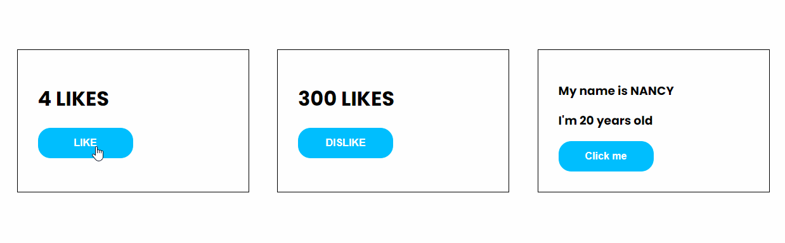

# React Class Components



## 🦉 Main information

A simple and easy exercise to understand how to work with React class components.

The project goals:
- understand what does it means - React class component and how to work with it
- create components to learn how to change initial state
- learn more about React Lifecycle Methods

## 🦊 Useful links

### React.Component

```
https://legacy.reactjs.org/docs/react-component.html
```

### Components and Props

```
https://legacy.reactjs.org/docs/components-and-props.html
```

### State and Lifecycle

```
https://react.dev/reference/react/Component#unsafe_componentwillmount
```


## ⚡ Built With

You can learn more in the [Create React App documentation](https://facebook.github.io/create-react-app/docs/getting-started).

To learn React, check out the [React documentation](https://reactjs.org/).
